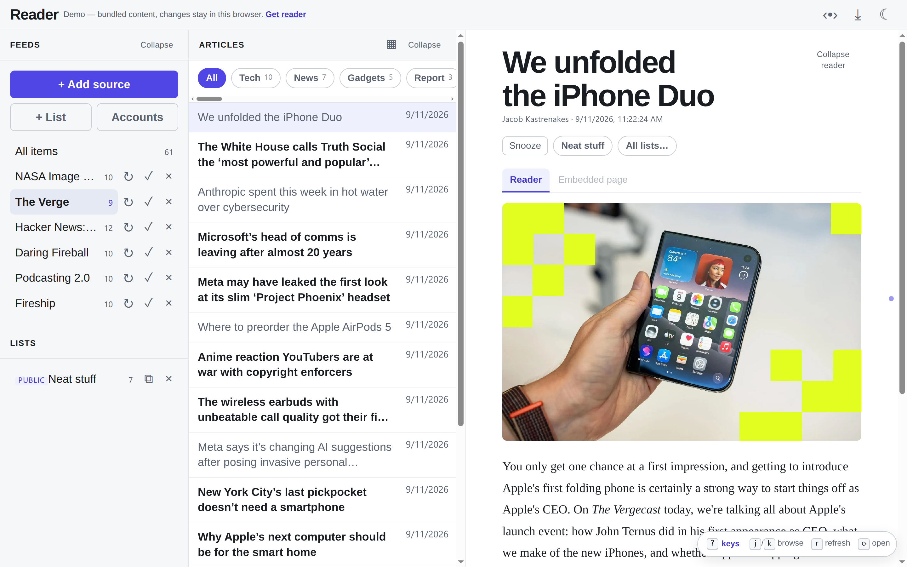
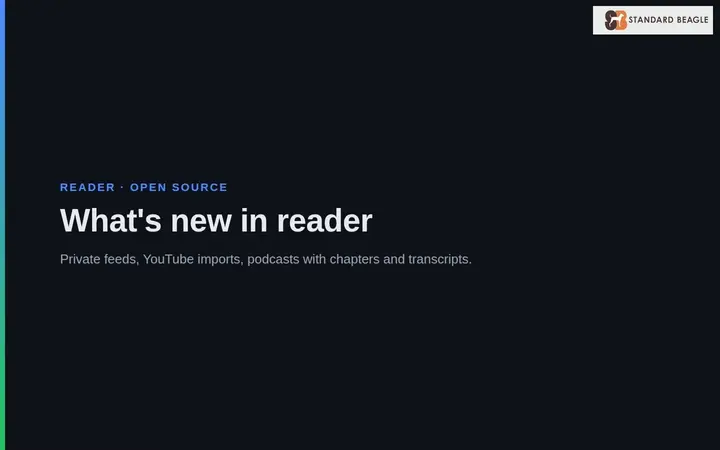

# reader

A Google Reader clone for the agent era — an RSS, Atom, JSON Feed and podcast reader that runs as an **Electron desktop app** or a **hosted web service** from one shared TypeScript codebase.

📚 **Docs: [dev.standardbeagle.com/reader](https://dev.standardbeagle.com/reader)** — quick start, user guide, API reference, hosting, configuration, and changelog.
🎯 **Demo: [dev.standardbeagle.com/reader/demo](https://dev.standardbeagle.com/reader/demo/)** — the full app on bundled content, no install.





The [Features page](https://dev.standardbeagle.com/reader/features/) has the same tour as video with narration.

RSS was always pull-based updates from publishers. Agents are exactly the kind of prolific, structured publishers that drown a chat UI but fit a feed perfectly. This reader treats feeds as the universal subscription format — blogs today, agent digests tomorrow.

## Features

- **Feed reading** — RSS, Atom, JSON Feed and IndieWeb h-feed pages; conditional GET, adaptive refresh intervals that honor the publisher's `ttl`, `Cache-Control` and `Retry-After`, exponential backoff on failures, and history backfill for feeds that page it (RFC 5005, JSON Feed `next_url`)
- **Private feeds** — username/password, access token, or OAuth 2.0 (PKCE) sign-in, each bound to the feed's own host
- **Imports** — OPML from any other reader, or YouTube subscriptions from a Google Takeout export
- **Podcasts** — in-reader player with Podcasting 2.0 chapters and transcripts; new episodes arrive as soon as Podping announces them
- **Classic three-pane UI** — feeds · article list · article view, with a mobile layout, swipe navigation, and installable PWA support
- **Pinboard view** — image-led card grid for the article list
- **Unread-only navigation** — edge dots mark unread neighbors; a header toggle restricts prev/next (buttons, swipe, j/k) to unread articles
- **Read state** — mark read on click, mark-all-read, per-feed unread counts
- **Snooze** — hide an article until later (later today / tomorrow / next week); it stays unread and resurfaces when the snooze expires
- **Saved lists** — permanent collections of articles, public or private; every public list is itself an RSS feed at `/lists/<token>.xml`
- **Ingestors** — Mastodon (hashtags or your home timeline), Bluesky, and Reddit as feeds, or several feeds merged into one AI-filtered, summarized view; digest modes and LLM keep/drop threshold
- **Connected accounts** — Mastodon and Reddit sign in through OAuth; no passwords stored
- **Real-time** — Mastodon streaming and Bluesky Jetstream deliver posts as they are published, over outbound connections only
- **Keyboard shortcuts** — j/k browse, snooze from the keyboard, bind keys to saved lists
- **XSS-safe rendering** — every article body sanitized server-side with DOMPurify
- **Local-first** — embedded SQLite, no account needed; the hosted mode shares the same codebase
- **Loopback-only by default** — binds 127.0.0.1; exposure is a deliberate opt-in

## Roadmap

| Milestone | Status | Contents |
|-----------|--------|----------|
| M1 | ✅ done | parser, sanitizer, storage, poller, API, minimal UI, Electron shell |
| M2 | 🔶 partial | keyboard nav (j/k shipped), snooze, saved lists; folders, starring, mark-read-on-scroll planned |
| M3 | planned | full-text search, per-feed full-text extraction (Readability) |
| M4 | 🔶 partial | OPML import shipped, hosted deployment live; multi-user (auth, Postgres) planned |
| M5 | planned | Google Reader API compat, offline web (service worker) |

Shipped since the roadmap was written: snooze, saved lists with public RSS feeds, ingestors (Mastodon / Bluesky / Reddit / combined AI view), OPML and YouTube imports, pinboard view, unread-only navigation, the hosted deployment behind Cloudflare Access, JSON Feed and h-feed, private-feed sign-in and OAuth connected accounts, podcasts with chapters and transcripts, history backfill, and real-time delivery (Podping, Mastodon streaming, Bluesky Jetstream).

Future direction: **agents as publishers** — an agent that can write an Atom file to a URL is already subscribable; a future milestone makes that first-class (watched directory / publish endpoint).

## Quickstart

Requires Node 22+ and pnpm.

```bash
pnpm install
pnpm -r build

# web dev (API on :3737, vite on :5173)
READER_PORT=3737 pnpm dev:server
pnpm dev:web

# desktop (after one-time native rebuild, see apps/desktop/README.md)
pnpm --filter @reader/desktop dev

# tests
pnpm -r test
```

## Architecture

```
apps/
  web/          React + Vite SPA
  desktop/      Electron shell (forks the server on 127.0.0.1, random port)
packages/
  core/         feed parsing (RSS/Atom/JSON Feed/h-feed), transcripts, imports, HTML sanitization — no I/O
  server/       Fastify API, background poller, ingestors, OAuth sign-in, real-time streams, storage adapter (SQLite now, Postgres in M4)
```

Design spec: [docs/superpowers/specs/2026-08-01-reader-clone-design.md](docs/superpowers/specs/2026-08-01-reader-clone-design.md)

## License

[MIT](LICENSE)
