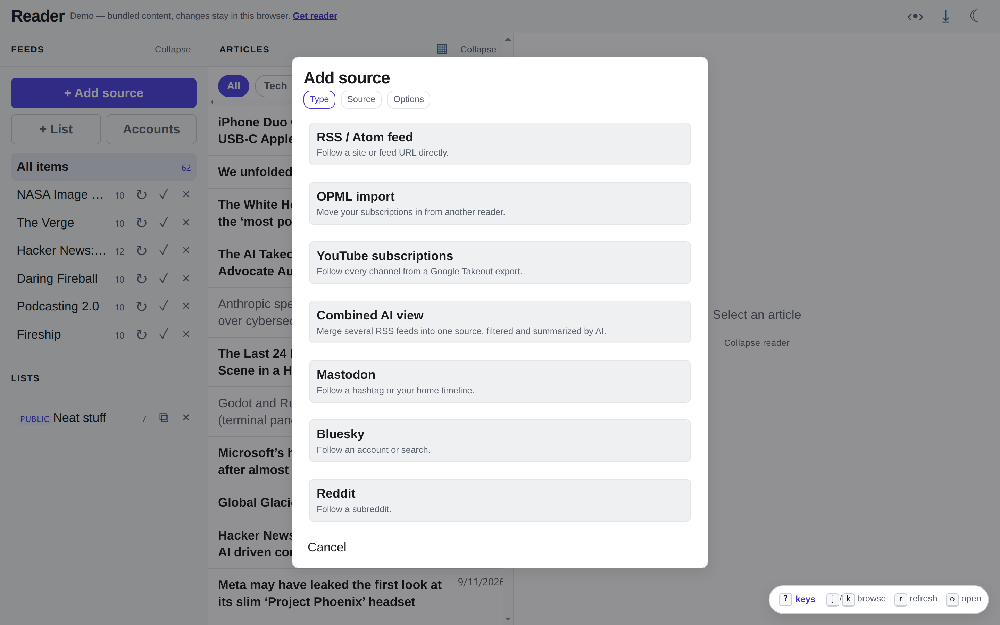
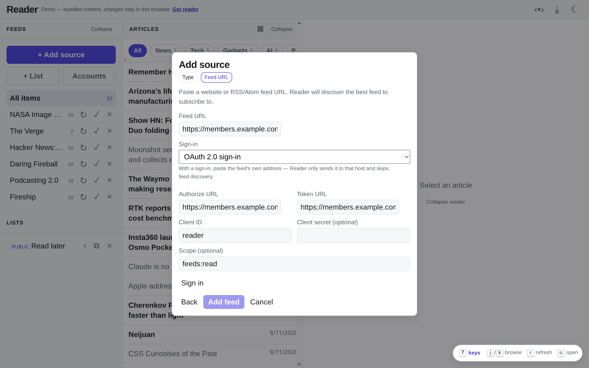
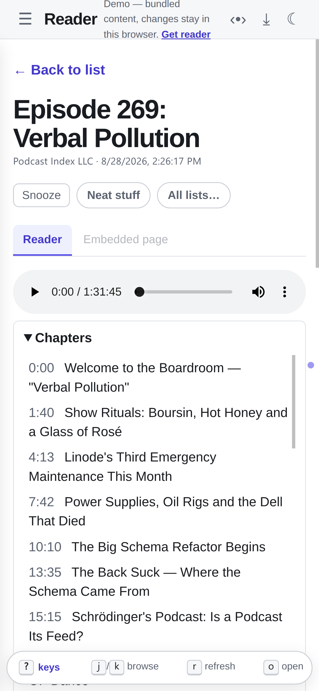

reader follows the classic Google Reader layout and keeps what worked about
it: feeds on the left, a dense list in the middle, the article on the right.
Everything below runs in the desktop app and the hosted web service alike,
and you can try most of it in the [demo](/reader/demo/) without installing
anything.

A one-minute tour, narrated:

<video controls preload="metadata" playsinline poster="/reader/video/reader-features-poster.webp" style="width:100%;border-radius:8px">
  <source src="/reader/video/reader-features.webm" type="video/webm" />
  <track kind="captions" src="/reader/video/reader-features.vtt" srclang="en" label="English" />
</video>

## Follow anything that publishes

- **Every feed format.** RSS 2.0, RSS 1.0, Atom and JSON Feed, plus IndieWeb
  sites that publish no feed at all but mark their posts up as `h-entry`.
  Paste a home page and reader finds the feed.
- **Your old reader's subscriptions.** OPML import takes the export from
  Feedly, Inoreader, FreshRSS and the rest, up to 500 feeds at a time.
- **Your YouTube subscriptions.** YouTube has no subscriptions feed, so
  reader reads the `subscriptions.csv` from a Google Takeout export and
  follows each channel's own feed.
- **History, not just the latest page.** Feeds that link to older pages
  (RFC 5005, JSON Feed `next_url`) fill in up to ten pages when you subscribe.

[Adding sources](/reader/user/sources/) has the details.

## Private feeds

Paid newsletters, members-only podcasts and internal feeds can sign in with a
username and password, an access token, or OAuth 2.0 with PKCE. A sign-in is
bound to the feed's host: reader refuses to send it anywhere else, even when
the feed redirects.

## Podcasts

Episodes play in the reader. Shows that publish Podcasting 2.0 chapters and
transcripts get both under the player; click a chapter or a transcript line
to jump there. New episodes arrive as soon as the host announces them on
Podping, instead of at the next poll.

More in [Podcasts](/reader/user/podcasts/).

## Social timelines, filtered

Ingestors bring Mastodon (a hashtag or your own home timeline), Bluesky and
Reddit in as feeds. An LLM can score each post from 0 to 10, drop what falls
below your threshold, and write a clean title and summary for the rest.
Posts can arrive one by one or as hourly or daily batches. Mastodon and Reddit
sign in through OAuth, so no password is stored. Mastodon and Bluesky
posts arrive in real time over the Mastodon streaming API and Bluesky's
Jetstream. A **Combined AI view** does the same filtering over several of
your own RSS feeds.

See [Ingestors](/reader/user/ingestors/).

## Reading

- Three panes that collapse and resize, a single-pane flow on phones, and
  swipe between articles.
- A pinboard view: an image-led card grid, one click from the list.
- Unread-only navigation. Dots mark unread neighbors, and a header toggle
  makes previous/next skip what you've read.
- Subject filters built from each feed's categories.
- Snooze an article until later today, tomorrow or next week.
- Saved lists, private or public; a public list is itself an RSS feed.
- `j`/`k` to move, snooze keys, and keys you choose for saving to lists.

## Runs quietly, and stays yours

reader keeps everything in an embedded SQLite file and needs no account; the
desktop app and the hosted service run the same code. The server binds
127.0.0.1, and since sign-in redirects go through your browser and real-time
streams connect outward, neither needs a public address.

It polls politely: conditional GET, intervals that adapt to how often a feed
changes, and respect for a feed's `ttl`, `Cache-Control` and `Retry-After`.
Article HTML is sanitized on the server before the browser sees it, and
outbound fetches refuse private addresses.

[Configuration](/reader/configuration/) lists every switch;
[HTTP API](/reader/reference/api/) documents every endpoint.
