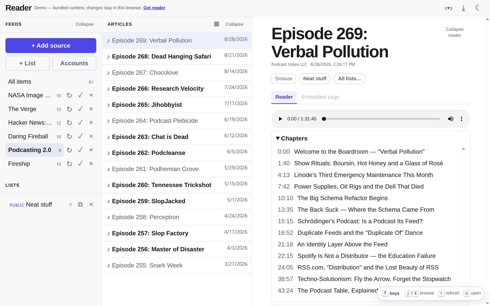
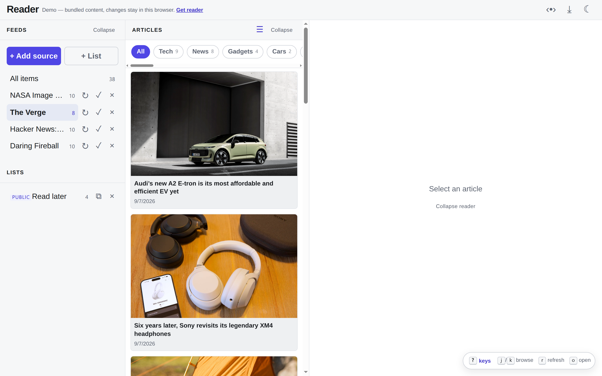
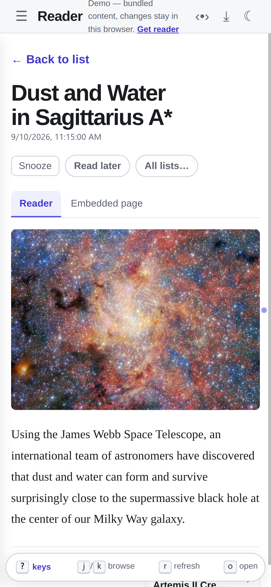

reader is an open-source Google Reader clone that runs as an **Electron desktop
app** or a **hosted web service** from one shared TypeScript codebase. RSS was
always pull-based updates from publishers; agents are exactly the kind of
prolific, structured publishers that drown a chat UI but fit a feed perfectly.
reader treats feeds as the universal subscription format — blogs today, agent
digests tomorrow.

## What you get

- **Feed reading** — RSS, Atom, JSON Feed, and IndieWeb h-feed pages.
  Background polling uses conditional GET, adapts its interval to how often a
  feed changes, and honors the publisher's `ttl`, `Cache-Control` and
  `Retry-After`. New subscriptions fill in older history when the feed pages
  it.
- **Private feeds** — sign in with a username and password, an access token,
  or OAuth 2.0. A sign-in is only ever sent to the host it belongs to.
- **Imports** — OPML from any other reader, or your YouTube subscriptions from
  a Google Takeout export.
- **Podcasts** — play episodes in the reader, jump by chapter or transcript
  line, and get new episodes as soon as the host announces them on Podping.
- **Classic three-pane UI** — feeds · article list · article view, with a
  mobile layout, swipe navigation, and installable PWA support.
- **Pinboard view** — an image-led card grid for the article list, one click
  from the dense list.
- **Unread-only navigation** — edge dots mark unread neighbors; a header toggle
  makes prev/next (buttons, swipe, and `j`/`k`) jump between unread articles.
- **Read state** — mark read on open, mark-all-read per feed, per-feed unread
  counts.
- **Snooze** — hide an article until later today, tomorrow, or next week; it
  stays unread and resurfaces when the snooze expires.
- **Saved lists** — permanent article collections, private or public; every
  public list is itself an RSS feed at `/lists/<token>.xml`.
- **Ingestors** — pull Mastodon (including your home timeline), Bluesky, or
  Reddit in as feeds, or merge several feeds into one AI-filtered, summarized
  view, with digest modes and an LLM keep/drop threshold. Mastodon and Reddit
  sign in through OAuth; Mastodon and Bluesky posts arrive in real time.
- **XSS-safe rendering** — every article body is sanitized server-side with
  DOMPurify.
- **Local-first** — embedded SQLite, no account needed; the hosted mode shares
  the same codebase.
- **Loopback-only by default** — the server binds 127.0.0.1; wider exposure is
  a deliberate opt-in. Sign-ins and real-time streams only ever connect out,
  so none of them needs a public address.

## See it

## Where to go next

- [Features](/reader/features/) — everything reader does, with screenshots.
- [Quick start](/reader/getting-started/) — run the web app or the desktop app.
- [Adding sources](/reader/user/sources/) — formats, private feeds, OPML and YouTube imports.
- [User guide](/reader/user/reading/) — the three-pane UI, filters, and navigation.
- [Hosting](/reader/hosting/) — systemd, Cloudflare tunnel, and the production layout.
- [Configuration](/reader/configuration/) — environment variables and secrets.
- [HTTP API](/reader/reference/api/) — every endpoint the SPA uses.
